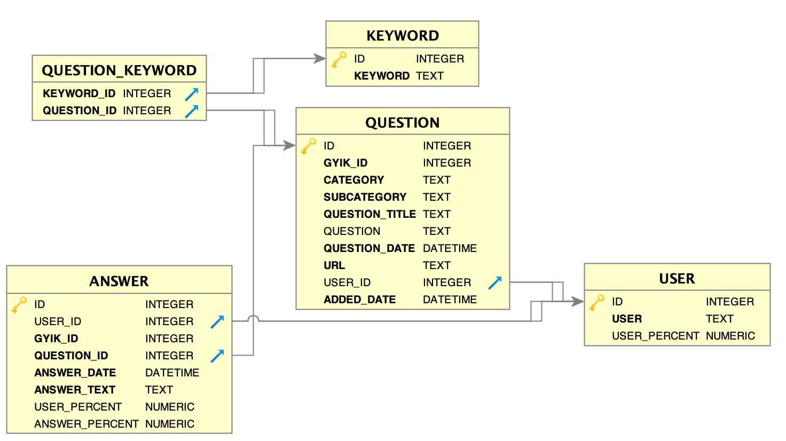

# GYK scraper

<<<<<<< HEAD
[](https://www.codacy.com/manual/DSuveges/gyik_scraper?utm_source=github.com&amp;utm_medium=referral&amp;utm_content=DSuveges/gyik_scraper&amp;utm_campaign=Badge_Grade)
=======
[](https://app.codacy.com/manual/DSuveges/gyik_scraper?utm_source=github.com&utm_medium=referral&utm_content=DSuveges/gyik_scraper&utm_campaign=Badge_Grade_Dashboard)
>>>>>>> a93495606bde75220dcbec25e68442d9015e1513

This code scrapes data from [gyakorikerdesek.hu](https://www.gyakorikerdesek.hu). The data is not too complex, but complex enough to make sense to load into an sqlite database. The loaded data then can be used to do some analytics.

Finally the code is getting into shape. User can decide to fetch all questions for a category, a range of a category by defining a start and end page or fetching a single question based on a provided URL.

## Usage

```bash
python gyik_scraper.py --database <str> \
            --category <str> \
            --startpage <int> \
            --endpage <int> \
            --directQuestion <str>
```

### where

* **database**: mandatory option, sqlite database file. If not exists, the script creates.
* **category**: mandatory option. Main GyIK category (eg. `tudomanyok`).
* **startpage**: optional. First page of questions to load. Default: 0.
* **lastpage**: optional. The last page of questions to load. Default: last page of questions.
* **directQuestion**: optional. If present only this question will be downloaded. Mostly for testing purposes.

The start page has to be lower then last page. To retrieve all questions for a category these paremeters needs to be omitted.

### SQLite schema



## TODO

* A test QC on a larger chunk of downloaded data.
* Integrate Codacy, Travis for code quality measure.

